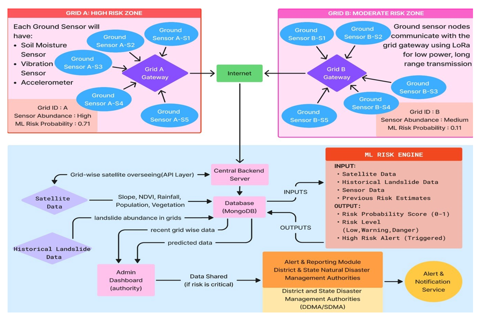

# Landslide Early Warning Prediction System

## Overview

The Landslide Early Warning Prediction System is an AI-powered geospatial platform designed to identify and predict landslide-prone regions using machine learning, GIS, remote sensing, and environmental data analysis. The system combines historical landslide records with terrain, rainfall, land-cover, and geological datasets to generate fine-grained risk assessments and support disaster preparedness efforts.

Built using Node.js, Express.js, MongoDB, Python, FastAPI, QGIS, and Google Earth Engine, the platform processes large-scale geospatial datasets and delivers landslide susceptibility predictions through interactive GIS-based visualizations and risk maps.

---

## Key Features

* Grid-based landslide risk assessment (500m × 500m resolution)
* Geospatial data processing using Google Earth Engine and QGIS
* Machine learning-powered landslide susceptibility prediction
* FastAPI-based AI inference services
* Interactive GIS risk visualization dashboard
* REST APIs for prediction and data management workflows

---

## System Workflow

Historical & Environmental Data
→ Feature Engineering
→ Machine Learning Model
→ FastAPI Inference Service
→ Backend APIs
→ GIS Dashboard & Risk Maps

---

## Tech Stack

**Backend:** Node.js, Express.js, MongoDB

**AI/ML:** Python, FastAPI, Scikit-learn

**Geospatial:** QGIS, Google Earth Engine (GEE), GIS, Remote Sensing

**Data Sources:** DEM, Rainfall, Land-Cover, Geological & Historical Landslide Datasets

---

## Screenshots

### Dashboard Overview

*Home page of the project*

---

### Landslide Risk Map

*Grid-based visualization highlighting low, medium, and high-risk regions.*

---

### Prediction Results(Satellite)

*Machine learning prediction output showing landslide susceptibility scores by the satellite information*

---

### Geospatial Data Layers

*Terrain, rainfall, elevation, and environmental layers used for feature generation.*

---
### Prediction Results(Ground)

*Machine learning prediction output showing landslide susceptibility scores by the Ground sensor deployed in the risk-prone area*

---

### System Architecture

*Architecture showing data ingestion, feature engineering, ML inference, backend services, and GIS visualization.*

---

## Recognition

🥈 2nd Place — TechSprint Manipur 1.0 (48-Hour AI Hackathon)

🥈 Runner-Up (2nd Place) — ReGen Hackathon 2.0

🎤 Exhibited at AI Impact Summit 2026 representing the Department of Information Technology, Government of Manipur

---

## Note

This repository serves as a public showcase of the project. The production codebase remains private while development and deployment discussions are ongoing.
